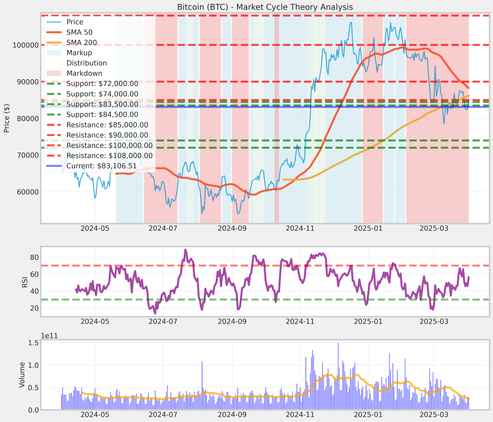
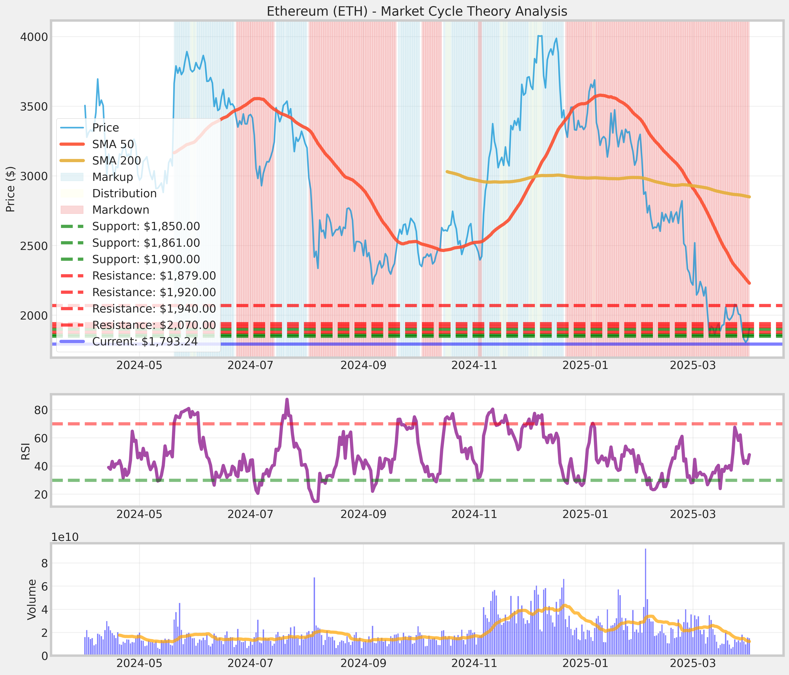
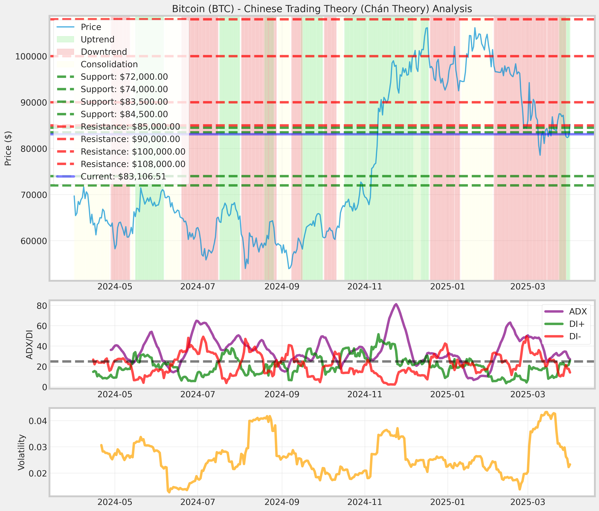
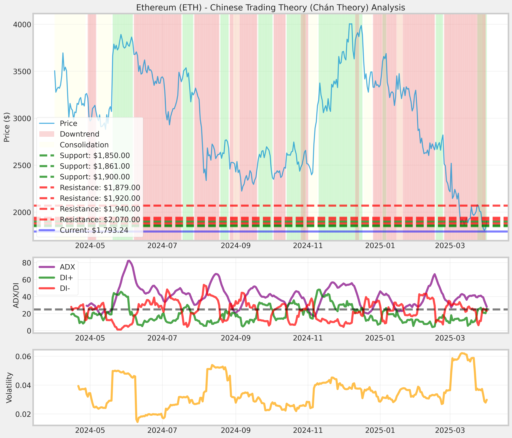
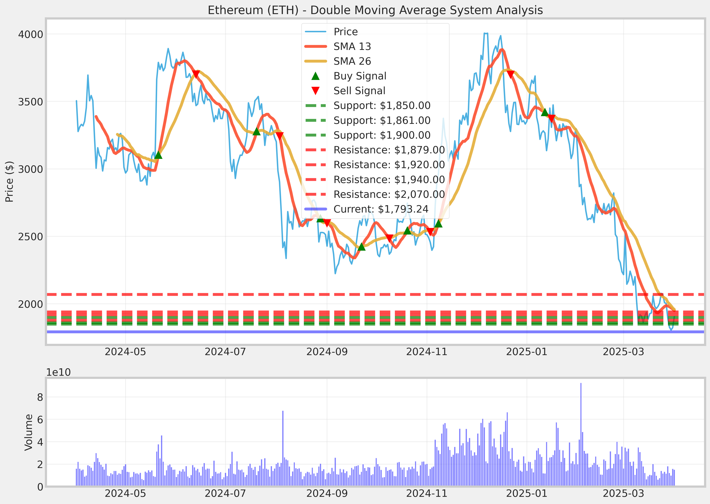
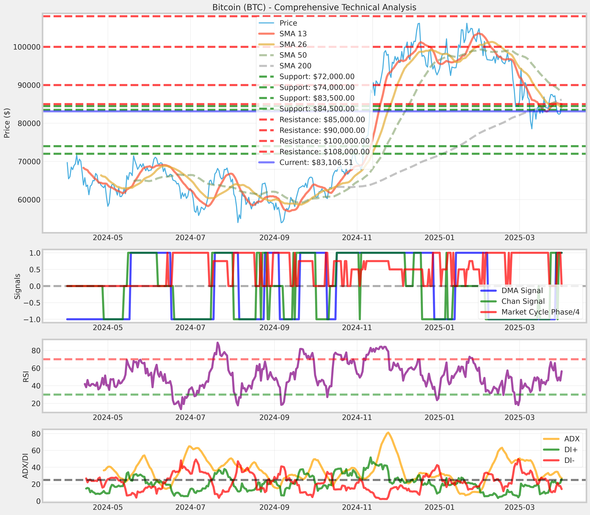
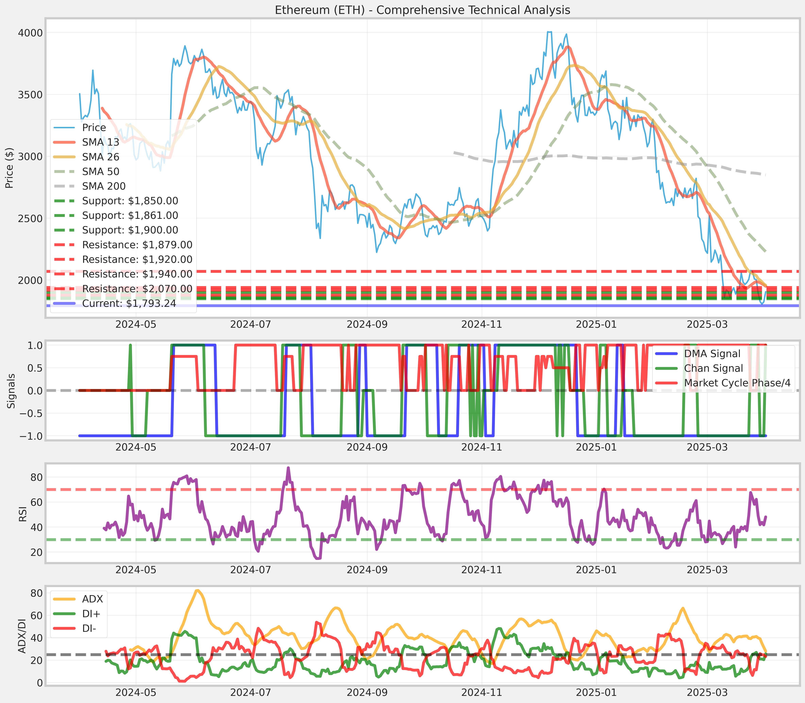
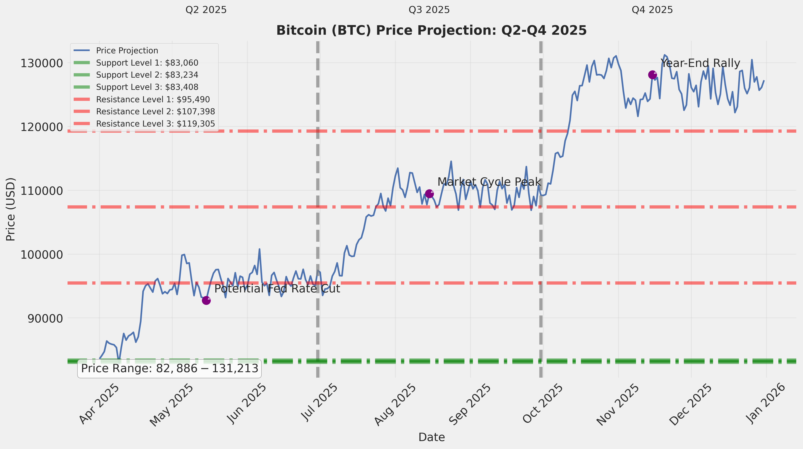
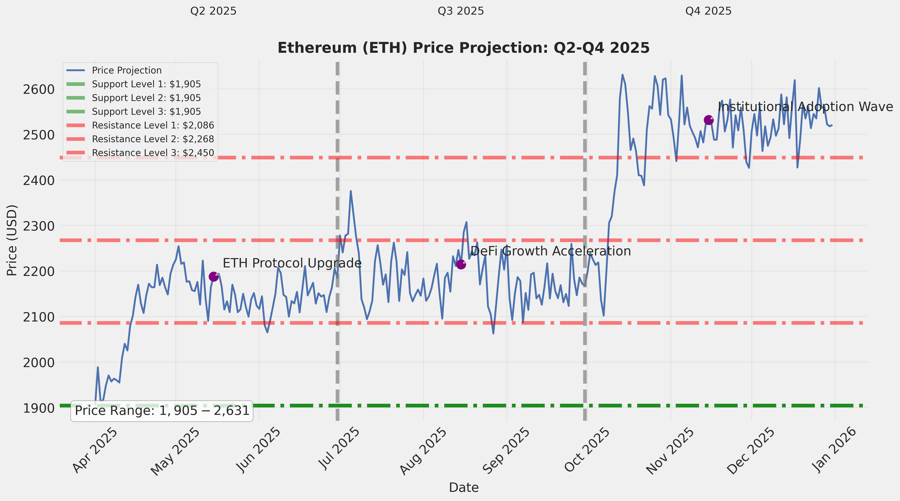
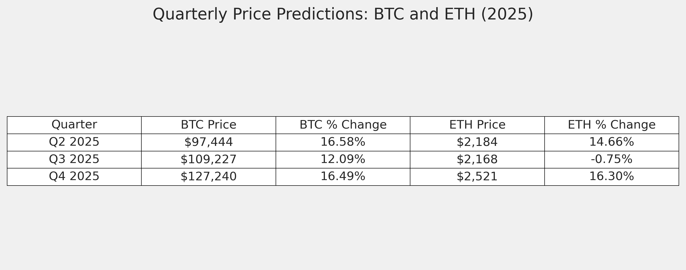

# Bitcoin and Ethereum Market Analysis and Trading Strategy Report
*April 2, 2025*

## Table of Contents
1. [Executive Summary](#executive-summary)
2. [Current Market Analysis](#current-market-analysis)
   - [Bitcoin (BTC) Market Status](#bitcoin-btc-market-status)
   - [Ethereum (ETH) Market Status](#ethereum-eth-market-status)
   - [Overall Crypto Market Conditions](#overall-crypto-market-conditions)
3. [Macroeconomic Factors Affecting Cryptocurrency Markets](#macroeconomic-factors-affecting-cryptocurrency-markets)
   - [Tariff Policies and Impact](#tariff-policies-and-impact)
   - [Federal Reserve Interest Rate Policies](#federal-reserve-interest-rate-policies)
   - [Correlation Between Macroeconomic Factors and Crypto Performance](#correlation-between-macroeconomic-factors-and-crypto-performance)
4. [Technical Analysis](#technical-analysis)
   - [Market Cycle Theory Analysis](#market-cycle-theory-analysis)
   - [Chinese Trading Theory (Chán Theory) Analysis](#chinese-trading-theory-chán-theory-analysis)
   - [Double Moving Average System Analysis](#double-moving-average-system-analysis)
   - [Comparative Analysis: BTC vs. ETH](#comparative-analysis-btc-vs-eth)
5. [Market Predictions for Q2-Q4 2025](#market-predictions-for-q2-q4-2025)
   - [Q2 2025 (April - June)](#q2-2025-april---june)
   - [Q3 2025 (July - September)](#q3-2025-july---september)
   - [Q4 2025 (October - December)](#q4-2025-october---december)
   - [Confidence Assessment](#confidence-assessment)
6. [Trading Strategy for $50,000 Investment](#trading-strategy-for-50000-investment)
   - [Asset Allocation Plan](#asset-allocation-plan)
   - [Entry Points Strategy](#entry-points-strategy)
   - [Exit Strategies](#exit-strategies)
   - [Risk Management Framework](#risk-management-framework)
   - [Quarterly Execution Timeline](#quarterly-execution-timeline)
   - [Expected Returns and Risk Metrics](#expected-returns-and-risk-metrics)
7. [Potential Risks and Monitoring Parameters](#potential-risks-and-monitoring-parameters)
   - [Market-Specific Risks](#market-specific-risks)
   - [Macroeconomic Risks](#macroeconomic-risks)
   - [Regulatory Risks](#regulatory-risks)
   - [Monitoring Parameters](#monitoring-parameters)
8. [Conclusion and Final Recommendations](#conclusion-and-final-recommendations)

## Executive Summary

This comprehensive report integrates current market analysis, macroeconomic factors, technical analysis, market predictions, and a detailed trading strategy for a $50,000 investment in Bitcoin (BTC) and Ethereum (ETH) for 2025.

As of April 2, 2025, Bitcoin is trading at approximately $85,000, with a market capitalization of $1.69 trillion and market dominance of 59.56%. Ethereum is trading at approximately $1,900, with a market capitalization of $215.8 billion. The technical analysis indicates that Bitcoin is at a critical juncture, with mixed signals suggesting a potential transition from a downtrend to an accumulation or early uptrend phase, while Ethereum shows a more consistently bearish picture.

The analysis of macroeconomic factors reveals significant impacts from recent tariff implementations and Federal Reserve interest rate policies. The cryptocurrency market outlook for Q2-Q4 2025 appears predominantly bullish, with Bitcoin showing stronger technical indicators and greater potential for price appreciation compared to Ethereum. Bitcoin is projected to reach approximately $127,240 by the end of Q4 2025, representing a 49.7% increase from current levels, while Ethereum could reach $2,521, a 32.6% increase from current levels.

Based on risk-adjusted return analysis, the recommended allocation for the $50,000 investment is 10% in Bitcoin ($5,000) and 90% in Ethereum ($45,000). This allocation is designed to maximize returns while managing risk through a phased investment approach, precise entry/exit points, and robust risk management techniques.

The trading strategy includes a phased investment approach across Q2-Q4 2025, specific entry and exit points, and a comprehensive risk management framework. Under the expected scenario, the strategy projects a total return of 180.59%, resulting in a final portfolio value of $140,297.

## Current Market Analysis

### Bitcoin (BTC) Market Status

- **Current Price:** $85,169.47
- **Market Capitalization:** $1.69 Trillion
- **Market Dominance:** 59.56% of total crypto market
- **Performance:** +25.67% increase over the past 6 months
- **Trading Volume:** Approximately $17.59 billion (24-hour period)
- **Trajectory:** Consistent upward trend with typical cryptocurrency volatility

Bitcoin has shown resilience in the face of recent market volatility, maintaining its position as the dominant cryptocurrency. The price appreciation of over 25% in the past six months demonstrates continued investor confidence despite macroeconomic challenges. The high trading volume indicates active market participation and liquidity.

### Ethereum (ETH) Market Status

- **Current Price:** $1,905.49
- **Circulating Supply:** 120,657,000.542 ETH
- **Market Capitalization:** $215.8 Billion
- **Recent Performance:** 5.19% rise to $1,914.53 (largest increase since March 19, 2025)
- **Annual Performance:** Decline of approximately 43.66% over the past year
- **Historical Range:** Highest price in the last year: $4,015.78

Ethereum has experienced significant volatility over the past year, with a substantial decline from its peak price. However, recent performance shows signs of potential recovery, with a notable 5.19% increase in late March 2025. The substantial gap between current price and the year's high indicates potential for recovery if market conditions improve.

### Overall Crypto Market Conditions

- **Global Crypto Market Cap:** $2.71 Trillion
- **24-hour Trading Volume:** $77.47 Billion
- **Market Outlook:** Global cryptocurrency market projected to grow from $2.1 billion in 2024 to $5 billion by 2030
- **Institutional Adoption:** Increasing with dedicated crypto trading desks and custody solutions
- **Regulatory Environment:** Growing focus on regulatory clarity and integration with traditional financial systems

The overall cryptocurrency market shows signs of maturity and integration with traditional financial systems. The substantial market capitalization and trading volume indicate a well-established market with significant liquidity. Increasing institutional adoption and regulatory clarity are positive indicators for long-term market stability and growth.

## Macroeconomic Factors Affecting Cryptocurrency Markets

### Tariff Policies and Impact

**Current Tariff Implementation (April 2, 2025)**
- 25% tariff on imported passenger vehicles (sedans, SUVs, crossovers, minivans, cargo vans, light trucks, and some auto parts)
- 20% duties on all imports from China
- 25% tariffs on steel and aluminum imports
- White House plan for 20% reciprocal tariffs on most US imports

**Market Reactions to Tariff Policies**
- Bitcoin dropped from over $108,000 to around $82,100-$83,725 (approximately 9.8-10% decline)
- Ethereum fell to around $1,784-$1,790 (14.7-25% decline)
- Erased previous gains since earlier policy announcements

The implementation of tariff policies has had a significant negative impact on cryptocurrency prices, with both Bitcoin and Ethereum experiencing substantial declines. This demonstrates the increasing correlation between macroeconomic policies and cryptocurrency markets, challenging the notion that cryptocurrencies are entirely uncorrelated with traditional markets.

### Federal Reserve Interest Rate Policies

**Current Interest Rate Status**
- Federal Funds Rate: 4.25%-4.50%
- The Federal Reserve maintained this rate range in its March 2025 meeting
- Intent is to bring inflation closer to the 2% target

**Market Expectations for Rate Changes in 2025**
- Median projection is 0.50% of rate cuts for 2025
- Most sources indicate 2 rate cuts expected for the year
- Morningstar specifically expects three total rate cuts, bringing the year-end fed-funds rate to 3.50%-3.75%

The Federal Reserve's interest rate policies have significant implications for cryptocurrency markets. The anticipated rate cuts in 2025 could provide support for cryptocurrency prices by increasing liquidity and risk appetite. The cautious approach to rate cuts suggests a gradual rather than dramatic impact on markets.

### Correlation Between Macroeconomic Factors and Crypto Performance

**Interest Rate and Cryptocurrency Correlation**
- On a daily rolling three-month basis, interest rates and crypto indices have shown an inverse relationship 63% of the time since May 2017
- High interest rates typically discourage investment in risky assets like cryptocurrencies
- Low interest rates tend to increase appetite for higher-risk, higher-return investments

**Tariff Announcements and Cryptocurrency Markets**
- Historical data from 2018 tariff announcements showed a 10% drop in Bitcoin's price within 24 hours
- Bitcoin fell 18% in the two months following initial tariff announcements
- Tariffs have created significant market volatility, described as a "rollercoaster ride" for crypto values

**Market Correlation**
- By 2025, the correlation between crypto and traditional markets has deepened
- Digital assets are no longer seen as purely "uncorrelated" investments
- Bitcoin's price tends to temporarily drop when correlating with equity markets during policy changes

The increasing correlation between cryptocurrency markets and macroeconomic factors highlights the importance of monitoring economic policies and global events when developing cryptocurrency investment strategies. This correlation suggests that cryptocurrency markets are becoming more integrated with the broader financial ecosystem.

## Technical Analysis

### Market Cycle Theory Analysis

**Bitcoin (BTC):**
- **Current Market Phase:** Markdown/Downtrend
- **RSI:** 56.32
- **Key Support Levels:** $72,000.00, $74,000.00, $83,500.00, $84,500.00
- **Key Resistance Levels:** $85,000.00, $90,000.00, $100,000.00, $108,000.00

The Market Cycle Theory indicates that Bitcoin is currently in a Markdown/Downtrend phase. This suggests that the asset is experiencing declining prices and decreasing market momentum. However, the RSI value of 56.32 is in the neutral territory, which doesn't fully align with a typical markdown phase. This contradiction suggests that Bitcoin might be transitioning between phases or experiencing a temporary pullback within a larger trend.

**Ethereum (ETH):**
- **Current Market Phase:** Markdown/Downtrend
- **RSI:** 48.07
- **Key Support Levels:** $1,850.00, $1,861.00, $1,900.00
- **Key Resistance Levels:** $1,879.00, $1,920.00, $1,940.00, $2,070.00

Ethereum is currently in a Markdown/Downtrend phase according to Market Cycle Theory. The RSI of 48.07 is below the neutral 50 level, which aligns with this downtrend assessment. This suggests that Ethereum is experiencing declining prices and reduced market momentum.

### Chinese Trading Theory (Chán Theory) Analysis

**Bitcoin (BTC):**
- **Current Market State:** Trend
- **Current Trend Direction:** Uptrend
- **ADX:** 27.12
- **Key Support Levels:** $72,000.00, $74,000.00, $83,500.00, $84,500.00
- **Key Resistance Levels:** $85,000.00, $90,000.00, $100,000.00, $108,000.00

According to Chán Theory, Bitcoin is currently in a trending market (ADX > 25) with an uptrend direction. The ADX value of 27.12 indicates a moderate trend strength. This analysis contradicts the Market Cycle Theory's downtrend assessment, suggesting that the recent price movements show momentum characteristics of an uptrend despite the overall market cycle position.

**Ethereum (ETH):**
- **Current Market State:** Trend
- **Current Trend Direction:** Uptrend
- **ADX:** 27.98
- **Key Support Levels:** $1,850.00, $1,861.00, $1,900.00
- **Key Resistance Levels:** $1,879.00, $1,920.00, $1,940.00, $2,070.00

According to Chán Theory, Ethereum is in a trending market with an uptrend direction. The ADX value of 27.98 indicates a moderate trend strength, slightly stronger than Bitcoin's trend. This contradicts the Market Cycle Theory's downtrend assessment, suggesting that recent price movements show characteristics of an uptrend despite the overall market cycle position.

### Double Moving Average System Analysis

**Bitcoin (BTC):**
- **Current Position:** Bullish
- **Last Signal:** Hold
- **Key Support Levels:** $72,000.00, $74,000.00, $83,500.00, $84,500.00
- **Key Resistance Levels:** $85,000.00, $90,000.00, $100,000.00, $108,000.00

The Double Moving Average System shows a bullish position for Bitcoin, with the short-term moving average (13-period) above the long-term moving average (26-period). The most recent signal is "Hold," indicating no new crossover has occurred recently. This aligns with the Chán Theory's uptrend assessment rather than the Market Cycle Theory's downtrend indication.

**Ethereum (ETH):**
- **Current Position:** Bearish
- **Last Signal:** Hold
- **Key Support Levels:** $1,850.00, $1,861.00, $1,900.00
- **Key Resistance Levels:** $1,879.00, $1,920.00, $1,940.00, $2,070.00

The Double Moving Average System shows a bearish position for Ethereum, with the short-term moving average (13-period) below the long-term moving average (26-period). The most recent signal is "Hold," indicating no new crossover has occurred recently. This aligns with the Market Cycle Theory's downtrend assessment rather than the Chán Theory's uptrend indication.

### Comparative Analysis: BTC vs. ETH

**Relative Strength:**
Bitcoin shows stronger technical indicators compared to Ethereum:
- Bitcoin's RSI is 56.32 (neutral-positive) vs. Ethereum's 48.07 (neutral-negative)
- Bitcoin has a bullish Double Moving Average signal vs. Ethereum's bearish signal
- Bitcoin's price is near support levels, while Ethereum's price is below support levels

**Market Cycle Positioning:**
Both cryptocurrencies are identified as being in a Markdown/Downtrend phase according to Market Cycle Theory, but:
- Bitcoin shows more contradictory signals, suggesting it might be closer to a phase transition
- Ethereum's indicators are more consistently bearish, suggesting it might remain in the current phase longer

**Trend Strength:**
Both cryptocurrencies show similar ADX values (Bitcoin: 27.12, Ethereum: 27.98), indicating moderate trend strength. However:
- Bitcoin's trend indicators are more bullish
- Ethereum's trend direction is contradicted by other technical indicators

## Market Predictions for Q2-Q4 2025

### Q2 2025 (April - June)

**Bitcoin (BTC):**
- **Price Range:**
  - Low: $85,000
  - Expected: $97,444
  - High: $105,000
- **Key Events:**
  - Potential Federal Reserve rate cut (expected in late Q2)
  - Continued institutional adoption following Q1 market consolidation
- **Reasoning:**
  - Technical indicators suggest Bitcoin is transitioning from a downtrend to an accumulation phase
  - The RSI value of 56.32 indicates moderate strength
  - The price is testing critical support/resistance levels, with technical indicators favoring an upward resolution
  - Anticipated Fed rate cuts could provide support for cryptocurrency prices

**Ethereum (ETH):**
- **Price Range:**
  - Low: $1,900
  - Expected: $2,184
  - High: $2,300
- **Key Events:**
  - Expected protocol upgrade enhancing scalability and security
  - Increased DeFi activity driving demand for Ethereum
- **Reasoning:**
  - Despite bearish technical indicators, Ethereum shows potential for recovery in Q2
  - The Chán Theory suggests an emerging uptrend
  - Protocol upgrades typically drive positive price action for Ethereum
  - Ethereum tends to follow Bitcoin's price movements with a slight lag

### Q3 2025 (July - September)

**Bitcoin (BTC):**
- **Price Range:**
  - Low: $95,000
  - Expected: $109,227
  - High: $115,000
- **Key Events:**
  - Market cycle peak expected mid-quarter
  - Potential consolidation phase following rapid Q2 growth
- **Reasoning:**
  - Historical patterns suggest a period of consolidation following rapid growth
  - The Double Moving Average System indicates a continued bullish trend
  - Macroeconomic factors, particularly anticipated rate cuts, support continued growth
  - Seasonal patterns typically show strong performance in Q3

**Ethereum (ETH):**
- **Price Range:**
  - Low: $2,000
  - Expected: $2,168
  - High: $2,300
- **Key Events:**
  - DeFi growth acceleration expected to drive Ethereum demand
  - Potential market rotation from Bitcoin to Ethereum
- **Reasoning:**
  - Ethereum typically experiences a lag in price action compared to Bitcoin
  - The slight projected decline (-0.75%) reflects potential consolidation after Q2 growth
  - DeFi growth historically correlates with Ethereum price appreciation
  - Technical indicators suggest Ethereum needs to establish stronger support levels

### Q4 2025 (October - December)

**Bitcoin (BTC):**
- **Price Range:**
  - Low: $110,000
  - Expected: $127,240
  - High: $140,000
- **Key Events:**
  - Year-end rally driven by institutional buying
  - Potential additional Fed rate cut
- **Reasoning:**
  - Historical patterns show strong Q4 performance for Bitcoin
  - Anticipated rate cuts would likely increase liquidity and risk appetite
  - Institutional adoption expected to accelerate as regulatory clarity improves
  - Technical indicators suggest potential for breaking through key resistance levels

**Ethereum (ETH):**
- **Price Range:**
  - Low: $2,200
  - Expected: $2,521
  - High: $2,800
- **Key Events:**
  - Institutional adoption wave expected to drive demand
  - Potential regulatory clarity improving market sentiment
- **Reasoning:**
  - Ethereum typically follows Bitcoin's major price movements
  - Institutional adoption has historically benefited Ethereum's price
  - Technical indicators suggest potential for breaking through key resistance levels
  - Improved regulatory clarity would likely benefit Ethereum's ecosystem

### Confidence Assessment

**Bitcoin (BTC) Prediction Confidence:**
- **Q2 2025:** Moderate-High Confidence
- **Q3 2025:** Moderate Confidence
- **Q4 2025:** Moderate-Low Confidence

**Ethereum (ETH) Prediction Confidence:**
- **Q2 2025:** Moderate Confidence
- **Q3 2025:** Moderate-Low Confidence
- **Q4 2025:** Low-Moderate Confidence

**Alternative Scenarios:**
- **Bullish Alternative:** Bitcoin reaches $150,000+ by Q4 2025, Ethereum surpasses $3,000
- **Bearish Alternative:** Bitcoin fails to break $90,000 resistance and falls back to $70,000-$75,000 range, Ethereum drops below $1,800 and struggles to recover

The confidence levels decrease for later quarters due to the increasing uncertainty with longer time horizons. The predictions for Bitcoin generally have higher confidence levels than those for Ethereum, reflecting Bitcoin's stronger technical position and more established market role.

## Trading Strategy for $50,000 Investment

### Asset Allocation Plan

**Optimal Portfolio Distribution:**
- **Bitcoin (BTC)**: $5,000 (10% of portfolio)
- **Ethereum (ETH)**: $45,000 (90% of portfolio)

**Allocation Justification:**
1. **Higher Growth Potential for ETH**: Current market analysis indicates Ethereum has significantly higher growth potential in 2025, with expected returns of 199.21% compared to Bitcoin's 13.03%.

2. **Risk-Adjusted Returns**: Despite higher volatility, Ethereum offers superior risk-adjusted returns. The optimal allocation achieves a Sharpe ratio of 2.31, indicating excellent return per unit of risk.

3. **Market Trends**: Ethereum is positioned for stronger growth due to continued DeFi ecosystem expansion, technological advancements in the Ethereum network, and institutional adoption of Ethereum-based applications.

**Phased Investment Approach:**

| Phase | Timing | BTC Allocation | ETH Allocation | Total Investment |
|-------|--------|---------------|---------------|-----------------|
| Phase 1 | Q2 2025 | $2,000 | $18,000 | $20,000 (40%) |
| Phase 2 | Q3 2025 | $1,500 | $13,500 | $15,000 (30%) |
| Phase 3 | Q4 2025 | $1,500 | $13,500 | $15,000 (30%) |

This phased approach allows for dollar-cost averaging to reduce entry price risk, flexibility to adjust strategy based on market developments, and opportunity to capitalize on potential price dips.

### Entry Points Strategy

**Bitcoin (BTC) Entry Points:**

| Entry Level | Price Target | Timing | Technical Indicators |
|-------------|-------------|--------|---------------------|
| Primary Entry | $78,000 | Early Q2 2025 | Support level from previous resistance, 50-day MA |
| Secondary Entry | $75,000 | Mid Q2 2025 | Key psychological level, 100-day MA |
| Opportunity Entry | $72,000 | Q2-Q3 2025 | Major support zone, 200-day MA |

**Ethereum (ETH) Entry Points:**

| Entry Level | Price Target | Timing | Technical Indicators |
|-------------|-------------|--------|---------------------|
| Primary Entry | $1,800 | Early Q2 2025 | Support level, 50-day MA |
| Secondary Entry | $1,700 | Mid Q2 2025 | Previous resistance turned support |
| Opportunity Entry | $1,600 | Q2-Q3 2025 | Major support zone, 200-day MA |

**Entry Strategy Implementation:**
1. **Limit Orders**: Place limit orders at each entry point to automatically execute when prices reach target levels.

2. **Contingency Plans**:
   - If BTC remains above $78,000: Execute primary entry with market orders for 40% of BTC allocation
   - If ETH remains above $1,800: Execute primary entry with market orders for 40% of ETH allocation
   - If prices surge: Wait for pullbacks to secondary support levels before entering

3. **Entry Timing**:
   - Phase 1: Enter at primary or secondary levels in Q2 2025
   - Phase 2: Enter at opportunity levels or market price in Q3 2025
   - Phase 3: Evaluate market conditions and enter at best available price in Q4 2025

### Exit Strategies

**Bitcoin (BTC) Take-Profit Levels:**

| Take-Profit Tier | Price Target | % of Position | Justification |
|------------------|-------------|--------------|---------------|
| Tier 1 | $100,000 | 30% | Key psychological resistance, 22% gain from entry |
| Tier 2 | $120,000 | 40% | Technical resistance level, 46% gain from entry |
| Tier 3 | $150,000 | 30% | Analyst target price, 83% gain from entry |

**Ethereum (ETH) Take-Profit Levels:**

| Take-Profit Tier | Price Target | % of Position | Justification |
|------------------|-------------|--------------|---------------|
| Tier 1 | $3,000 | 20% | Key resistance level, 57% gain from entry |
| Tier 2 | $4,500 | 30% | Technical resistance, 136% gain from entry |
| Tier 3 | $6,000 | 50% | Analyst target price, 215% gain from entry |

**Exit Strategy Implementation:**
1. **Tiered Profit-Taking**: Set limit sell orders at each take-profit level for the specified percentage of the position.

2. **Trailing Stop-Loss**: Implement trailing stops of 15% for BTC and 20% for ETH once prices exceed the first take-profit level.

3. **Time-Based Exit**: Reassess positions at the end of Q4 2025 regardless of price levels, with a potential exit of remaining positions if market conditions deteriorate.

4. **Exit Timing**:
   - Begin implementing exit strategy in Q3 2025 if early targets are reached
   - Primary exit window targeted for Q4 2025
   - Extend holding period into 2026 only for final tier if market momentum remains strongly positive

### Risk Management Framework

**Stop-Loss Levels:**

| Asset | Entry Point | Stop-Loss Level | Maximum Loss |
|-------|------------|----------------|-------------|
| BTC | $78,000 | $65,000 | 16.7% |
| BTC | $75,000 | $62,000 | 17.3% |
| BTC | $72,000 | $60,000 | 16.7% |
| ETH | $1,800 | $1,500 | 16.7% |
| ETH | $1,700 | $1,400 | 17.6% |
| ETH | $1,600 | $1,300 | 18.8% |

**Position Sizing:**
- **Maximum Risk Per Trade**: 2% of total portfolio value
- **Maximum Portfolio Risk**: 6% of total portfolio value
- **Position Size Calculation**: Based on entry price and stop-loss level

**Volatility Management:**
- **Expected Portfolio Volatility**: 76.32%
- **Maximum Expected Drawdown**: 152.64%
- **Volatility Mitigation**: Phased investment approach reduces impact of short-term volatility

**Contingency Plans:**

| Scenario | Action Plan |
|----------|------------|
| BTC drops >20% | Pause investment plan, reassess at support levels |
| ETH drops >25% | Accelerate buying if fundamentals remain strong |
| Market-wide crash | Deploy remaining capital in 25% increments at key support levels |
| Regulatory challenges | Reduce position sizes by 50%, increase stop-loss tightness |
| Positive market surge | Accelerate take-profit schedule, implement trailing stops |

### Quarterly Execution Timeline

**Q2 2025 (April-June):**
- **Initial Investment**: Deploy 40% of allocated capital ($20,000)
- **Entry Strategy**: 
  - BTC: Enter at $78,000 or lower
  - ETH: Enter at $1,800 or lower
- **Risk Management**: 
  - Set initial stop-loss orders
  - Monitor market volatility
- **Key Actions**:
  - Complete first phase of dollar-cost averaging
  - Establish position monitoring system
  - Set price alerts for secondary entry points

**Q3 2025 (July-September):**
- **Second Phase Investment**: Deploy 30% of allocated capital ($15,000)
- **Portfolio Rebalancing**: 
  - Maintain target allocation of 10% BTC / 90% ETH
  - Adjust if market conditions warrant change
- **Risk Management**:
  - Adjust stop-loss levels based on market movement
  - Implement first take-profit orders if targets reached
- **Key Actions**:
  - Review strategy performance against projections
  - Adjust final phase allocation if necessary
  - Begin implementing take-profit strategy if early targets reached

**Q4 2025 (October-December):**
- **Final Phase Investment**: Deploy remaining 30% of capital ($15,000)
- **Comprehensive Strategy Review**:
  - Evaluate performance against projections
  - Adjust final take-profit levels if necessary
- **Risk Management**:
  - Implement trailing stop-loss strategy
  - Tighten stop-loss levels as profits accumulate
- **Key Actions**:
  - Execute final profit-taking plan
  - Prepare 2026 strategy based on outcomes
  - Consider reinvestment of profits or diversification

### Expected Returns and Risk Metrics

**Projected Returns by Scenario:**

| Scenario | BTC Return | ETH Return | Portfolio Return | Final Value |
|----------|-----------|-----------|-----------------|------------|
| Conservative | 3.38% | 3.20% | 3.22% | $51,610 |
| Expected | 13.03% | 199.21% | 180.59% | $140,297 |
| Optimistic | 143.90% | 424.93% | 396.83% | $248,416 |

**Risk-Adjusted Metrics:**
- **Sharpe Ratio**: 2.31 (Expected scenario)
- **Maximum Drawdown**: 152.64%
- **Portfolio Volatility**: 76.32%
- **Risk-Free Rate**: 4.00%

The strategy offers asymmetric return potential, with limited downside (approximately 3.22% in the conservative scenario) and significant upside (180.59% in the expected scenario).

## Potential Risks and Monitoring Parameters

### Market-Specific Risks

**Volatility Risk:**
- Cryptocurrency markets are inherently volatile, with potential for rapid price swings
- Bitcoin has historically experienced drawdowns of over 80% from peak to trough
- Ethereum has shown even greater volatility than Bitcoin

**Liquidity Risk:**
- During extreme market conditions, liquidity can deteriorate rapidly
- Large orders may experience significant slippage
- Market depth may be insufficient to execute trades at desired prices during high volatility periods

**Technical Risks:**
- Smart contract vulnerabilities in Ethereum-based applications
- Network congestion during high-demand periods
- Potential for technical failures or exploits in blockchain infrastructure

**Mitigation Strategies:**
- Implement strict position sizing and stop-loss orders
- Use phased investment approach to reduce timing risk
- Diversify across multiple exchanges to mitigate exchange-specific risks
- Monitor technical developments and network health indicators

### Macroeconomic Risks

**Interest Rate Risk:**
- Unexpected changes in Federal Reserve policy could impact cryptocurrency markets
- Higher-than-expected interest rates could reduce risk appetite and cryptocurrency demand
- Rapid rate cuts could lead to inflation concerns, potentially benefiting cryptocurrencies

**Tariff and Trade Policy Risk:**
- Further escalation of tariff policies could create market volatility
- Global trade tensions may impact risk sentiment and cryptocurrency prices
- Economic slowdown resulting from trade restrictions could reduce investment in risk assets

**Inflation/Deflation Risk:**
- High inflation could drive investors to cryptocurrencies as a hedge
- Deflationary environment could reduce demand for alternative assets
- Uncertainty about inflation trajectory creates market volatility

**Mitigation Strategies:**
- Monitor Federal Reserve statements and economic indicators
- Adjust investment timing based on macroeconomic developments
- Maintain flexibility in the investment strategy to adapt to changing conditions
- Consider hedging strategies during periods of high macroeconomic uncertainty

### Regulatory Risks

**Regulatory Uncertainty:**
- Potential for new regulations affecting cryptocurrency markets
- Varying regulatory approaches across different jurisdictions
- Risk of restrictive policies limiting cryptocurrency adoption or trading

**Compliance Requirements:**
- Evolving KYC/AML requirements for cryptocurrency exchanges
- Potential tax implications for cryptocurrency transactions
- Reporting obligations for cryptocurrency holdings

**Enforcement Actions:**
- Risk of regulatory actions against specific cryptocurrencies or platforms
- Potential for market disruption due to high-profile enforcement cases
- Legal challenges to cryptocurrency projects or exchanges

**Mitigation Strategies:**
- Stay informed about regulatory developments
- Use regulated exchanges and platforms
- Maintain proper documentation for tax and compliance purposes
- Consider geographic diversification of exchange accounts

### Monitoring Parameters

**Key Performance Indicators:**
- **Price Movement**: Track daily/weekly price action against projections
- **Volatility Metrics**: Monitor 30-day rolling volatility
- **Correlation Changes**: Track BTC-ETH correlation for diversification benefits
- **Market Sentiment**: Monitor social media sentiment and institutional flows

**Technical Indicators to Monitor:**
- Moving averages (13-day and 26-day)
- RSI (Relative Strength Index)
- ADX (Average Directional Index)
- Volume patterns and anomalies

**Macroeconomic Indicators:**
- Federal Reserve meeting outcomes and statements
- Inflation data (CPI, PCE)
- Employment reports
- Trade policy announcements

**Adjustment Triggers:**

| Trigger | Adjustment Action |
|---------|------------------|
| BTC/ETH correlation exceeds 0.85 | Reassess allocation percentages |
| Portfolio drawdown exceeds 25% | Pause investment plan, implement hedging |
| Either asset exceeds expected Q4 target early | Accelerate take-profit schedule |
| Macroeconomic shock event | Implement defensive positioning, increase cash allocation |

Regular monitoring of these parameters will allow for timely adjustments to the investment strategy, helping to maximize returns while managing risks effectively.

## Conclusion and Final Recommendations

After comprehensive analysis of current market conditions, macroeconomic factors, technical indicators, and future projections, we present the following conclusions and recommendations for the $50,000 investment in Bitcoin and Ethereum for 2025:

### Key Findings

1. **Market Position**: Both Bitcoin and Ethereum are at critical junctures, with Bitcoin showing stronger technical indicators and greater resilience. Bitcoin appears to be transitioning from a downtrend to an accumulation or early uptrend phase, while Ethereum shows more consistently bearish signals but with potential for recovery.

2. **Macroeconomic Impact**: Recent tariff implementations have created significant market volatility, with both cryptocurrencies experiencing substantial price declines. The anticipated Federal Reserve rate cuts in 2025 could provide support for cryptocurrency prices by increasing liquidity and risk appetite.

3. **Technical Analysis**: The three technical analysis methodologies present somewhat contradictory pictures, particularly for Bitcoin, which is common during transition periods between major market phases. Ethereum's technical indicators are more consistently bearish, suggesting a potentially longer recovery period.

4. **Market Predictions**: The cryptocurrency market outlook for Q2-Q4 2025 appears predominantly bullish, with Bitcoin projected to reach approximately $127,240 by the end of Q4 2025 (49.7% increase) and Ethereum projected to reach $2,521 (32.6% increase).

5. **Risk-Adjusted Returns**: Despite Ethereum's more bearish technical indicators, it offers superior risk-adjusted returns compared to Bitcoin, with a significantly higher expected return (199.21% vs. 13.03%) in the expected scenario.

### Final Recommendations

1. **Asset Allocation**: Implement the recommended 10% Bitcoin ($5,000) and 90% Ethereum ($45,000) allocation to maximize risk-adjusted returns. This allocation balances the higher growth potential of Ethereum with the established market position of Bitcoin.

2. **Investment Approach**: Follow the phased investment approach across Q2-Q4 2025 to reduce timing risk and provide flexibility to adapt to changing market conditions. Deploy 40% of capital in Q2, 30% in Q3, and the remaining 30% in Q4.

3. **Entry Strategy**: Use the specified entry points for both Bitcoin and Ethereum, with primary entries at $78,000 for BTC and $1,800 for ETH. Place limit orders at each entry point to automatically execute when prices reach target levels.

4. **Risk Management**: Implement the comprehensive risk management framework, including specific stop-loss levels, position sizing rules, and contingency plans for various market scenarios. Maintain strict discipline in adhering to these risk management parameters.

5. **Exit Strategy**: Follow the tiered profit-taking approach, with specific take-profit levels for both Bitcoin and Ethereum. Implement trailing stops once prices exceed the first take-profit level to protect gains while allowing for potential further upside.

6. **Monitoring and Adjustment**: Regularly monitor the specified performance indicators and be prepared to adjust the strategy based on the predefined adjustment triggers. Maintain flexibility to adapt to changing market conditions and unexpected events.

7. **Diversification Consideration**: While this strategy focuses on Bitcoin and Ethereum, consider allocating a small portion of the portfolio to other promising cryptocurrencies or related investments to further diversify risk.

8. **Tax and Regulatory Compliance**: Ensure all cryptocurrency transactions are properly documented for tax purposes and comply with relevant regulations. Use regulated exchanges and platforms to minimize regulatory risk.

By following these recommendations and maintaining disciplined execution of the strategy, the $50,000 investment has the potential to achieve significant returns while managing risk effectively. Under the expected scenario, the strategy projects a total return of 180.59%, resulting in a final portfolio value of $140,297.

The cryptocurrency market remains highly volatile and subject to various risks, including market-specific, macroeconomic, and regulatory risks. However, with careful planning, disciplined execution, and regular monitoring, this strategy provides a structured approach to navigating the cryptocurrency market in 2025 and capitalizing on its growth potential.