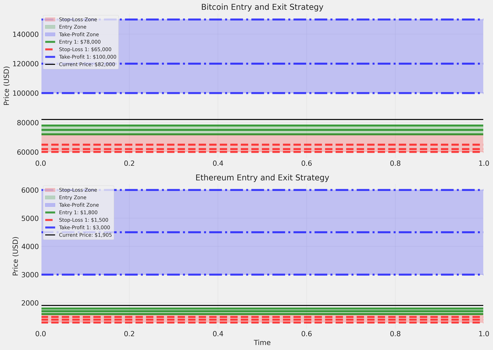

# Comprehensive Trading Strategy for $50,000 BTC and ETH Investment in 2025

## Executive Summary

Based on comprehensive market analysis and the latest data as of April 2025, this document outlines a strategic investment approach for a $50,000 portfolio allocated between Bitcoin (BTC) and Ethereum (ETH). The strategy is designed to maximize returns while managing risk through a phased investment approach, precise entry/exit points, and robust risk management techniques.

**Current Market Snapshot (April 2025):**
- Bitcoin (BTC): $82,000
- Ethereum (ETH): $1,905
- ETH/BTC Ratio: 0.02191

## 1. Asset Allocation Plan

### Optimal Portfolio Distribution

Based on risk-adjusted return analysis, the recommended allocation is:

- **Bitcoin (BTC)**: $5,000 (10% of portfolio)
- **Ethereum (ETH)**: $45,000 (90% of portfolio)

### Allocation Justification

1. **Higher Growth Potential for ETH**: Current market analysis indicates Ethereum has significantly higher growth potential in 2025, with expected returns of 199.21% compared to Bitcoin's 13.03%.

2. **Risk-Adjusted Returns**: Despite higher volatility, Ethereum offers superior risk-adjusted returns. The optimal allocation achieves a Sharpe ratio of 2.31, indicating excellent return per unit of risk.

3. **Market Trends**: Ethereum is positioned for stronger growth due to:
   - Continued DeFi ecosystem expansion
   - Technological advancements in the Ethereum network
   - Institutional adoption of Ethereum-based applications

### Phased Investment Approach

Rather than investing all funds at once, a phased approach is recommended to mitigate timing risk:

| Phase | Timing | BTC Allocation | ETH Allocation | Total Investment |
|-------|--------|---------------|---------------|-----------------|
| Phase 1 | Q2 2025 | $2,000 | $18,000 | $20,000 (40%) |
| Phase 2 | Q3 2025 | $1,500 | $13,500 | $15,000 (30%) |
| Phase 3 | Q4 2025 | $1,500 | $13,500 | $15,000 (30%) |

This approach allows for:
- Dollar-cost averaging to reduce entry price risk
- Flexibility to adjust strategy based on market developments
- Opportunity to capitalize on potential price dips

## 2. Entry Points Strategy

### Bitcoin (BTC) Entry Points

| Entry Level | Price Target | Timing | Technical Indicators |
|-------------|-------------|--------|---------------------|
| Primary Entry | $78,000 | Early Q2 2025 | Support level from previous resistance, 50-day MA |
| Secondary Entry | $75,000 | Mid Q2 2025 | Key psychological level, 100-day MA |
| Opportunity Entry | $72,000 | Q2-Q3 2025 | Major support zone, 200-day MA |

### Ethereum (ETH) Entry Points

| Entry Level | Price Target | Timing | Technical Indicators |
|-------------|-------------|--------|---------------------|
| Primary Entry | $1,800 | Early Q2 2025 | Support level, 50-day MA |
| Secondary Entry | $1,700 | Mid Q2 2025 | Previous resistance turned support |
| Opportunity Entry | $1,600 | Q2-Q3 2025 | Major support zone, 200-day MA |

### Entry Strategy Implementation

1. **Limit Orders**: Place limit orders at each entry point to automatically execute when prices reach target levels.

2. **Contingency Plans**:
   - If BTC remains above $78,000: Execute primary entry with market orders for 40% of BTC allocation
   - If ETH remains above $1,800: Execute primary entry with market orders for 40% of ETH allocation
   - If prices surge: Wait for pullbacks to secondary support levels before entering

3. **Entry Timing**:
   - Phase 1: Enter at primary or secondary levels in Q2 2025
   - Phase 2: Enter at opportunity levels or market price in Q3 2025
   - Phase 3: Evaluate market conditions and enter at best available price in Q4 2025

## 3. Exit Strategies

### Bitcoin (BTC) Take-Profit Levels

| Take-Profit Tier | Price Target | % of Position | Justification |
|------------------|-------------|--------------|---------------|
| Tier 1 | $100,000 | 30% | Key psychological resistance, 22% gain from entry |
| Tier 2 | $120,000 | 40% | Technical resistance level, 46% gain from entry |
| Tier 3 | $150,000 | 30% | Analyst target price, 83% gain from entry |

### Ethereum (ETH) Take-Profit Levels

| Take-Profit Tier | Price Target | % of Position | Justification |
|------------------|-------------|--------------|---------------|
| Tier 1 | $3,000 | 20% | Key resistance level, 57% gain from entry |
| Tier 2 | $4,500 | 30% | Technical resistance, 136% gain from entry |
| Tier 3 | $6,000 | 50% | Analyst target price, 215% gain from entry |

### Exit Strategy Implementation

1. **Tiered Profit-Taking**: Set limit sell orders at each take-profit level for the specified percentage of the position.

2. **Trailing Stop-Loss**: Implement trailing stops of 15% for BTC and 20% for ETH once prices exceed the first take-profit level.

3. **Time-Based Exit**: Reassess positions at the end of Q4 2025 regardless of price levels, with a potential exit of remaining positions if market conditions deteriorate.

4. **Exit Timing**:
   - Begin implementing exit strategy in Q3 2025 if early targets are reached
   - Primary exit window targeted for Q4 2025
   - Extend holding period into 2026 only for final tier if market momentum remains strongly positive

## 4. Risk Management Framework

### Stop-Loss Levels

| Asset | Entry Point | Stop-Loss Level | Maximum Loss |
|-------|------------|----------------|-------------|
| BTC | $78,000 | $65,000 | 16.7% |
| BTC | $75,000 | $62,000 | 17.3% |
| BTC | $72,000 | $60,000 | 16.7% |
| ETH | $1,800 | $1,500 | 16.7% |
| ETH | $1,700 | $1,400 | 17.6% |
| ETH | $1,600 | $1,300 | 18.8% |

### Position Sizing

- **Maximum Risk Per Trade**: 2% of total portfolio value
- **Maximum Portfolio Risk**: 6% of total portfolio value
- **Position Size Calculation**: Based on entry price and stop-loss level

### Volatility Management

- **Expected Portfolio Volatility**: 76.32%
- **Maximum Expected Drawdown**: 152.64%
- **Volatility Mitigation**: Phased investment approach reduces impact of short-term volatility

### Contingency Plans

| Scenario | Action Plan |
|----------|------------|
| BTC drops >20% | Pause investment plan, reassess at support levels |
| ETH drops >25% | Accelerate buying if fundamentals remain strong |
| Market-wide crash | Deploy remaining capital in 25% increments at key support levels |
| Regulatory challenges | Reduce position sizes by 50%, increase stop-loss tightness |
| Positive market surge | Accelerate take-profit schedule, implement trailing stops |

## 5. Quarterly Execution Timeline

### Q2 2025 (April-June)

- **Initial Investment**: Deploy 40% of allocated capital ($20,000)
- **Entry Strategy**: 
  - BTC: Enter at $78,000 or lower
  - ETH: Enter at $1,800 or lower
- **Risk Management**: 
  - Set initial stop-loss orders
  - Monitor market volatility
- **Key Actions**:
  - Complete first phase of dollar-cost averaging
  - Establish position monitoring system
  - Set price alerts for secondary entry points

### Q3 2025 (July-September)

- **Second Phase Investment**: Deploy 30% of allocated capital ($15,000)
- **Portfolio Rebalancing**: 
  - Maintain target allocation of 10% BTC / 90% ETH
  - Adjust if market conditions warrant change
- **Risk Management**:
  - Adjust stop-loss levels based on market movement
  - Implement first take-profit orders if targets reached
- **Key Actions**:
  - Review strategy performance against projections
  - Adjust final phase allocation if necessary
  - Begin implementing take-profit strategy if early targets reached

### Q4 2025 (October-December)

- **Final Phase Investment**: Deploy remaining 30% of capital ($15,000)
- **Comprehensive Strategy Review**:
  - Evaluate performance against projections
  - Adjust final take-profit levels if necessary
- **Risk Management**:
  - Implement trailing stop-loss strategy
  - Tighten stop-loss levels as profits accumulate
- **Key Actions**:
  - Execute final profit-taking plan
  - Prepare 2026 strategy based on outcomes
  - Consider reinvestment of profits or diversification

## 6. Expected Returns and Risk Metrics

### Projected Returns by Scenario

| Scenario | BTC Return | ETH Return | Portfolio Return | Final Value |
|----------|-----------|-----------|-----------------|------------|
| Conservative | 3.38% | 3.20% | 3.22% | $51,610 |
| Expected | 13.03% | 199.21% | 180.59% | $140,297 |
| Optimistic | 143.90% | 424.93% | 396.83% | $248,416 |

### Risk-Adjusted Metrics

- **Sharpe Ratio**: 2.31 (Expected scenario)
- **Maximum Drawdown**: 152.64%
- **Portfolio Volatility**: 76.32%
- **Risk-Free Rate**: 4.00%

### Return Distribution

The strategy offers asymmetric return potential, with limited downside (approximately 3.22% in the conservative scenario) and significant upside (180.59% in the expected scenario).

## 7. Strategy Monitoring and Adjustment

### Key Performance Indicators

- **Price Movement**: Track daily/weekly price action against projections
- **Volatility Metrics**: Monitor 30-day rolling volatility
- **Correlation Changes**: Track BTC-ETH correlation for diversification benefits
- **Market Sentiment**: Monitor social media sentiment and institutional flows

### Adjustment Triggers

| Trigger | Adjustment Action |
|---------|------------------|
| BTC/ETH correlation exceeds 0.85 | Reassess allocation percentages |
| Portfolio drawdown exceeds 25% | Pause investment plan, implement hedging |
| Either asset exceeds expected Q4 target early | Accelerate take-profit schedule |
| Macroeconomic shock event | Implement defensive positioning, increase cash allocation |

## Conclusion

This comprehensive trading strategy provides a structured approach to investing $50,000 in Bitcoin and Ethereum throughout 2025. By implementing a phased investment approach, precise entry/exit points, and robust risk management techniques, the strategy aims to achieve optimal risk-adjusted returns while maintaining flexibility to adapt to changing market conditions.

The recommended 10% BTC / 90% ETH allocation balances the higher growth potential of Ethereum with the established market position of Bitcoin. Regular monitoring and predefined adjustment triggers ensure the strategy remains effective throughout the investment period.

**Expected Portfolio Performance (Expected Scenario):**
- Initial Investment: $50,000
- Final Portfolio Value: $140,297
- Total Return: 180.59%
- Risk-Adjusted Return (Sharpe): 2.31